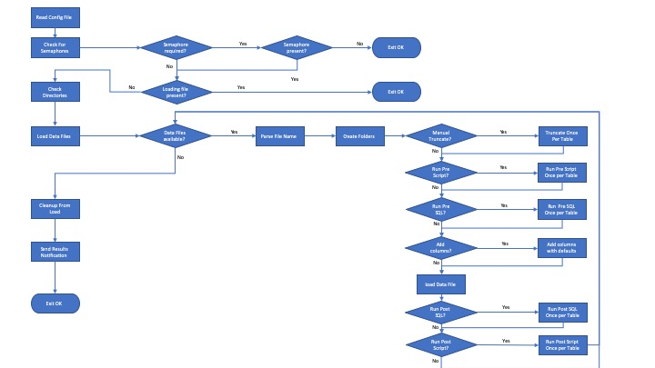

# Loading scripts and utilities - Index

In this folder you will find the script for automating data loads:

- [Load Files](#user-content-load-files)

Besides the `load_files` script, there are also two other scripts available in the `load_files` folder of the community tools. Both these scripts can be useful in the process of data preparation and validation.

- [csv_to_sql](#user-content-csv_to_sql)
- [diff_csv_to_schema](#user-content-diff_csv_to_schema)

## Load Files

The `load_files` script is a bash script which automates the process of loading files using ThoughtSpot's bulk loader `tsload`. The benefit of using `load_files` is that it's configurable and manages error handling, archiving loaded files as well as logging and reporting status. It supports the loading of local files as well as directly loading from an AWS S3 bucket (as-of TS v5.2).

### Loading data into ThoughtSpot

The whole purpose of the `load_files` script is to make the process of loading data as easy as possible. There are two scripts required, or actually one script and a configuration file.

- The `load_files` script. There should be no need to make any change to this script as all configuration should be done in the configuration files. If you do find bugs or issues in the `load_files` script itself, please post this issue on [ThoughtSpot Community](https://community.thoughtspot.com).
- A configuration file, e.g. `load.cfg` containing all the parameters and configuration required for the loading process. Note that because you can run the load script with different configurations, it's possible to support multiple databases and formats by creating multiple configuration files and running the script with the correct files.

#### Usage

The process can be launched from the command line, by executing the following command:

    load_files -f <configuration_file>

For example: 

    load_files -f load.cfg

Obviously, you can schedule this using any type of scheduler.

#### Pre-conditions and assumptions

- The database has been created in ThoughtSpot using TQL
- The table names are the same as the names of the files with some allowed deviations (see below), e.g. SalesData.csv goes into a SalesData table.
- The formats for dates, datetimes, boolean, and nulls are the same for all files. This is the best practice. However, we do support now format files allowing you to define different formats for different files
- (optional) Email has been configured on the cluster so that load results can be sent to indicate status of the load.

#### File names

The `load_files` script will determine which table to update based on the name of the file. This means that the table name should be present in the base file name (excluding extension).
File names are processed as follows:

- Only files with the extension provided in ***DATA_FILE_EXTENSION*** (defined in the configuration file) are processed.
- A file name can be suffixed by _full or _incremental at the end of the base file name (before the extension) to control what type of load should be run:
  - _full will do a full or historical load. This means that before loading this file, the script will first clear the table and then load the data (in one transaction)
  - _incremental will append the data to the existing data
  - If neither of these are specified, it will take the default setting in ***DEFAULT_EMPTY_TARGET*** in the configuration to determine whether data should be cleared before loading. Note: if you have multi-part files for a table, this option might not be suitable for you, and you probably want to utilize the ***TRUNCATE_BEFORE_LOAD*** option, which will truncate the tables only for the first file of this table (separate transactions)
- It is possible to provide additional information in the file name, such as timestamps or sequence numbers. Please specify these after a ‘-‘ (dash) in the file name after the table name, e.g. MyTableName-0000000001.csv. The process will strip everything after the dash and before the extension.
- If you want to provide other elements, or strip other elements from the file name you can do so by specifying sed patterns in ***SED_PATTERNS*** in the configuration file. The script will remove these as well.

The whole concept is that after stripping all the elements above, that the remaining part will be the name of the table.

#### Loading into Schemas

If you are loading all data in the same target schema, you can just specify this in the configuration file (***DEFAULT_SCHEMA_NAME***). If you are not using schemas, just leave this to the default setting of falcon_default_schema.

However, if you want to load into multiple schema, you can create sub folders in the data folder, one for each schema, and place the data files in the appropriate sub folder. The folder name should be identical to the name of the schema in the ThoughtSpot database.

For example, say you have a database called MY_COOL_DATABASE and have two different schemas called SCHEMA_A and SCHEMA_B with tables in each. You can create a directory for the data with two sub-directories named SCHEMA_A and SCHEMA_B, then put the data to be loaded into those sub-directories.

### Overview of the load_files process

Because `load_files` uses `tsload`, it must be run directly on the TS cluster. It can load files that are physically on the cluster, written to a drive that is mounted on the cluster, or written to AWS S3.

The `load_files` is typically run one of two ways.

1. Write all of the data to be loaded and then call `load_files` via SSH. This approach is preferred. 
2. Use a semaphore (trigger) file that is written after the files have been writing. Then `load_files` is run via cron or other scheduling tool on regular intervals. If the semaphore file exists then the script will load all of the data. After the files have been loaded the results can be emailed to an admin.

WARNING: Whatever process you implement, you must ensure that files are completely written before `tsload` runs. Failure to do so may result in partial data loads or errors.

The complete loading process is described in the diagram below.

| Step Name	| Sub Steps	| Description       |
| --------- | --------- | ----------------- |
| **Read Config File** | | Reads the configuration file passed to the script using the -f parameter |
| **Check for Semaphores** | Semaphore Required? | A semaphore is required when a name for a semaphore has been provided in the ***SEMAPHORE_FILE_NAME*** parameter in the configuration file. If left empty, it is not required |
| | Semaphore Present? | If the file name as specified in ***SEMAPHORE_FILE_NAME*** exists, the semaphore is present, otherwise stop the process |
| | Loading File Present? | Checks if the file specified in ***LOADING_FILE*** in the configuration file is present. If it is present it means another loading process is already running and no new loading processes will be started. Note that this process only checks the local process space, so it is possible another load is running on another machine. |
| **Check Directories** | | This process will check if the required directories exists. If the data directory does not exist the process will halt, all other required directories will be created when needed.|
| **Load Data Files** | Data Files Available? | This will check if any files matching the extension ***DATA_FILE_EXTENSION*** are present in the ***DATA_DIR***. If there are, they will be processed in sequence as found at the time of the start of the process. |
| | Parse File Name | The following logic will be derived from the file name: <ul><li>If the file sits in a sub folder in ***DATA_DIR***, the name of the sub folder is taken as the name of the target schema name. If it is not sitting in a sub folder it will load into the schema specified in ***DEFAULT_SCHEMA_NAME***</li><li>If the base file name ends at ‘_full’ the target table will be emptied as part of the `tsload` process (--emptytarget)</li><li>If the base file name ends at ‘_incremental’, data will be appended to the target table</li><li>If neither ‘_full’ or ‘_incremental’ are specified, the setting in ***DEFAULT_EMPTY_TARGET*** will be used to decide whether to empty the target before loading</li><li>If there are any sed patterns defined in ***SED_PATTERNS***, these will be removed from the file name as well.</li></ul> After all these rules, whatever is left of the file name string (without extension) will be used as the target table name.|
| | Create Folders | Create any required folders, if they have not been created before. |
| |	Manual Truncate? | This is a special option for truncating which has been designed for case where input files might be delivered in parts, i.e. multiple files per table with a sequence number. In this case we cannot use the built-in truncate option as that would clear the table for every file. Setting the option ***TRUNCATE_BEFORE_LOAD*** to true will execute a manual truncate command before the `tsload` process. |
| | Truncate Once Per Table | This will execute a manual truncate only once per table, i.e. the first time a table is ‘seen’ in this load process it will execute and not for the others.    Note: This is done a separate statement, which means that is for whatever reason the `tsload` process fails, the tables still would have been truncated (unlike the built-in truncate) |
| | Run Pre Script? | This allows you to execute any shell script before loading the table. Only one shell script per table can be executed. The statements can be defined in the array pre_load_shell in the configuration file, where they key is the table name. |
| | Run Pre Script Once Per Table | Execute a shell script before loading the table. For example: deleting some old data based on a on very custom criteria, maybe from a parameter file. |
| | Run Pre SQL? | This allows you to execute any TQL supported SQL statement before loading the table. Only one SQL statement per table can be executed. The statements can be defined in the array pre_load_sql in the configuration file, where they key is the table name. |
| | Run Pre SQL Once Per Table | Execute a SQL statement before loading the table. For example: deleting some old data based on a date range. |
| | Add Columns? | This is for scenarios where you want to provide default values for columns that are not in the data. These are specified in ***extra_table_headers*** (for the column names) and ***extra_table_values*** (for the values) |
| | Add columns with defaults | Add the columns to the data file as specified in the configuration file. |
| | Load Data File | This will execute the actual `tsload` process. All required parameters can be defined in the config file. |
| | Run Post SQL?	| This is similar as the Pre SQL, with the difference that these are run after the `tsload`. They are defined in the post_load_sql. |
| | Run Post SQL Once Per Table	| Run the Post SQL commands if specified for each table once. |
| | Run Post Script? | This allows you to execute any shell script after loading the table. Only one shell script per table can be executed. The statements can be defined in the array post_load_shell in the configuration file, where they key is the table name. |
| | Run Post Script Once Per Table | Execute a shell script after loading the table. For example: verifying some data or kicking off another unrelated process. |
| **Cleanup From Load** | | This step will clean up all temporary files and will archive the source data and log files according to the setting in ***ARCHIVE_DATA***.  It will also clean up old archives based on the number of days specified in ***NBR_DAYS_TO_KEEP_OLD_FILES***.|
| **Send Results Notification** | | If activated on the cluster this step well send an status email to the email addresses specified in ***RESULTS_EMAIL***, with the log attached.  If HTML email is enabled (***USE_HTML_EMAIL***), a nicely formatted table will be created in the body of the email, allowing an easy and quick insight into the results of the load.|

#### Note on shell scripts

A few comments around the use of shell scripts:

- When executing shell scripts it might happen that the script times out, i.e. returns to the shell whilst it is actually still doing things. This might result on the calling script to think it failed (as no return code). There are two variables in the config file to control this. One to define on how many times it should check for completeness (SCRIPT_MAX_CHECK_ATTEMPTS) and one variable defines how long to wait between checks (SCRIPT_CHECK_WAIT_TIME)
- For integration, a number of paramters are always passed to any script. Make sure these are interpreted in any custom script you create:
    -d|--database DATABASE_NAME   Name of the database where the table resides
    -s|--schema   SCHEMA_NAME     Name of the schema where the table resides
    -t|--table    TABLE_NAME      Name of the table to execute a delete for
    -c|--config   CONFIG_FILE     Name of the config file used in the load process
    -l|--log      LOG_FILE        Name of the log file to write logging messages to
    -f|--file     SOURCE_FILE     The souce file being loaded

### Deploy and configure

The `load_files` script assumes a particular file structure, i.e. there should be a root directory from where the scripts run. This directory is specified in the configuration file (***ROOT_DIR***).

Typically we would set up a structure as follows:

    /home/username	(ROOT_DIR)
    |------	bin			        (script files)
    |------	data	(DATA_DIR)	(the data to be loaded)
    |------	logs	(LOG_DIR)	(output dir for log files)
    |------	old	    (OLD_DIR)	(archive for processed files)

Although this is a typical set up, all directories can be configured to be anywhere. This is useful for example if you don’t want to store the data files and the archives in the home folder, but maybe on a mounted drive.

The first time you run it, it will create the sub-directories needed if they don’t exist. The subdirectories are relative to the ***ROOT_DIR*** defined in the configuration file. For example, let's say you have a mounted drive /tsmnt and want to use that for `load_files`. You might create a /bin directory and put `load_files` in that directory. Then configure to have ***ROOT_DIR*** point to /tsmnt. The first time `tsload` is run, it will create multiple subdirectories. This data directory is where `tsload` expects to find the data file.

Once `load_files` has been deployed, edit the configuration file to use the variables and flags that are for file locations, etc. Details of the configuration values are in the template `load.cfg`. You can have multiple configuration files for different scenarios and databases.

WARNING: The configuration flags are documented and expected to exist, so removing any can cause `load_files` to fail.

### The configuration file

The configuration file should be passed to the script via the -f parameter. The following table will describe the key parameters.

Note: The AWS parameters only need to be modified if data is loaded from AWS S3 buckets. Also note that an AWS configuration has their own parameters for ***DATA_DIR*** and archiving. 
Parameter	Description

| Section | Parameter | Description |
| --------- | --------- | ----------- |
| GENERAL SETTINGS | ***SOURCE_TYPE*** | Either file_system for local file loads or aws_s3 |
| FOLDER SETTINGS | ***ROOT_DIR*** | The root directory from which the script will operate. The load script will typically be in a bin folder in that root directory. |
| FOLDER SETTINGS | ***LOG_DIR*** | The directory where the log files should be written to. |
| FOLDER SETTINGS | ***IGNORE_DIRS*** | When scanning for input files the process will ignore directories with names specified in this list (space separated list) |
| FOLDER SETTINGS | ***DATA_DIR*** | Specifies the data directory where data files will be placed. |
| FOLDER SETTINGS | ***OLD_DIR_ROOT*** | The root folder for archiving |
| AWS S3 SETTINGS | ***AWS_S3_ACCESS_KEY_ID*** | The access key from your AWS Config. Note: recommended process is using IAM roles instead of these. Note that IAM role should have als write/delete access for load_files to work. |
| AWS S3 SETTINGS | ***AWS_S3_SECRET_ACCESS_KEY*** | The secret access key from your AWS config Note: recommended process is using IAM roles instead of these. Note that IAM role should have als write/delete access for load_files to work. |
| AWS S3 SETTINGS | ***AWS_S3_REGION*** | The region used, see: [AWS Service Endpoints](https://docs.aws.amazon.com/general/latest/gr/rande.html) |
| AWS S3 SETTINGS | ***AWS_S3_BUCKET*** | The name of the bucket for files to load |
| AWS S3 SETTINGS | ***AWS_S3_ARCHIVE_BUCKET*** | The name of the bucket to save loaded files. If blank no archiving will happen |
| AWS S3 SETTINGS | ***AWS_S3_DATA_DIR*** | The folder under the bucket to start loading from. This is the actual data root. |
| AWS S3 SETTINGS | ***AWS_S3_ARCHIVE_DIR*** | The folder under the bucket to archive data files to after loading. This can be either on the source or archive bucket. |
| AWS S3 SETTINGS | ***AWS_S3_BUF_CAPACITY*** | The buffer for loading files. |
| FILE SETTINGS | ***DATA_FILE_EXTENSION*** | The extension of the input data files, typically .csv |
| FILE SETTINGS | ***EXCLUDE_PATTERN*** | pattern which should be excluded in the files matched using the ***DATA_FILE_EXTENSION***
| FILE SETTINGS | ***SED_PATTERNS*** | Here you can set any part of the file name that will be stripped to determine the table name (excluding the ones which are already stripped internally) The items should be separated by space. |
| FILE SETTINGS | ***RUN_DOS2UNIX*** | If set to 1, the load script will run a dos2unix command against the input file before loading it. |
| ARCHIVE SETTINGS | ***MOVE_LOADED_FILES*** | This is the command to execute against files which have been loaded. Possible options are:<ul><li>mv    (moves the files)</li><li>cp     (copies the files)</li><li>echo (displays the file name)</li></ul>Typically you would have this on ‘mv’ to move and archive the files. The other two are typically used in troubleshooting input files issues (so you don’t have to extract and copy them from the archive each time) |
| ARCHIVE SETTINGS | ***NBR_DAYS_TO_KEEP_OLD_FILES*** | This is the number of days archive files will be kept in the OLD directory until the process will remove them. Leave this blank to not remove old archives. |
| ARCHIVE SETTINGS | ***ARCHIVE_DATA*** | This defines if and how data should be archived. For larger data files archiving can be time consuming and taking up space. The options are:<ul><li>always. Files are always archived.</li><li>onsuccess. Files are only archived when processed successfully (others stay in the source folder).</li><li>onerror. Files are archived when one of the files in the load failed.</li><li>onbad. Files are archived when one of the files generated bad records.</li><li>Never. Files are never archived.</li></ul>|
| EMAIL SETTINGS | ***RESULTS_EMAIL*** | The email addresses to which the result notification should be sent to. |
| EMAIL SETTINGS | ***USE_HTML_EMAIL*** | Set to 1 to receive notification emails in HTML format, 0 for standard text. |
| DATABASE SETTINGS | ***DATABASE_NAME*** | The name of the target database. Only one database is allowed per configuration file. |
| DATABASE SETTINGS | ***DEFAULT_SCHEMA_NAME*** | If input files are not placed in sub folders under the ***DATA_DIR***, this variable will define the name of the target schema. If no schema are used specify ‘falcon_default_schema’ here. |
| LOAD SETTINGS | ***SEMAPHORE_FILE_NAME*** | This is the name of the semaphore file the load process will look for before initiating the load. If left empty, the process will not wait for a semaphore to be present. |
| LOAD SETTINGS | ***TRUNCATE_BEFORE_LOAD*** | This can be used for multi-part input files. If set to true, it will truncate the target table manually once (before the first table file). In other cases just set this to false. |
| TSLOAD SETTINGS | ***DEFAULT_EMPTY_TARGET*** | (used by `tsload`)  This should either be empty or –empty_target. This is used for activate the built-in truncating of the target table. If left empty, no truncating will be done. See comments on truncating in situations will multi-part files earlier in this document. |
| TSLOAD SETTINGS | ***SOURCE_DATA_FORMAT*** | (used by `tsload`)  The source file format. Either csv or delimited |
| TSLOAD SETTINGS | ***FIELD_SEPARATOR*** | (used by `tsload`)  The field separator used in the source data |
| TSLOAD SETTINGS | ***MAX_IGNORED_ROWS*** | (used by `tsload`)  Maximum number of error rows to ignore. 0 is recommended for production. |
| TSLOAD SETTINGS | ***HAS_HEADER_ROW*** | (used by `tsload`)  True if there is a header row in the input file to ignore. |
| TSLOAD SETTINGS | ***NULL_VALUE*** | (used by `tsload`)  Value in the data which should be interpreted as a NULL value. |
| TSLOAD SETTINGS | ***DATE_FORMAT*** | (used by `tsload`)  The format for parsing dates, e.g. %m-%d-%Y |
| TSLOAD SETTINGS | ***DATE_TIME_FORMAT*** | (used by `tsload`)  The format for parsing date/times, e.g. %m-%d-%Y %H:%M:%s |
| TSLOAD SETTINGS | ***TIME_FORMAT*** | (used by `tsload`)  The format for parsing times, e.g. %H:%M:%s |
| TSLOAD SETTINGS | ***BOOLEAN_REPRESENTATION*** | (used by `tsload`)  Defines how to interpret Boolean values, e.g. True_False for True and False |
| TSLOAD SETTINGS | ***FORMAT_FILE_DIR*** | (used by `tsload`)  This allows you to use format files. These json files can define format overrides for particular tables. The json files should be stored in this folder and have the exact same name as the table, with the extension .json. If no format files are found or when this directory is empty it will use the settings from the main configuration file |
| PRE/POST SHELL SCRIPTS SETTINGS | ***pre_load_shell*** | This array a shell script per table which will be executed before the loading of a table. The key of the array should be the table name. Note if you specify @LOAD as the table name then the script will be executed at the beginning/end of the complete load process. |
| PRE/POST SHELL SCRIPTS SETTINGS | ***post_load_shell*** | This array a shell script per table which will be executed after the loading of a table. The key of the array should be the table name. Note if you specify @LOAD as the table name then the script will be executed at the beginning/end of the complete load process. |
| PRE/POST SHELL SCRIPTS SETTINGS | ***SCRIPT_MAX_CHECK_ATTEMPTS*** | If a script was not completed, but returned to shell (timeout) how many times it should keep on checking before failing. |
| PRE/POST SHELL SCRIPTS SETTINGS | ***SCRIPT_CHECK_WAIT_TIME*** | Time in seconds to wait in between attempts. |
| PRE/POST TQL COMMANDS SETTINGS | ***pre_load_tql*** | This array contains a TQL statement per table which will be executed before the loading of a table. The key of the array should be the table name. Note if you specify @LOAD as the table name then the script will be executed at the beginning/end of the complete load process. |
| PRE/POST TQL COMMANDS SETTINGS | ***post_load_tql*** | This array contains a TQL statement per table which will be executed after the loading of a table. The key of the array should be the table name. Note if you specify @LOAD as the table name then the script will be executed at the beginning/end of the complete load process. |
| GENERATE EXTRA (DEFAULT) COLUMNS HEADERS | ***extra_table_headers*** | This defines the column names of the columns which will be added to the data file before loading. Should be used in conjunction with ***extra_table_values***. |
| GENERATE EXTRA (DEFAULT) COLUMNS HEADERS | ***extra_table_values*** | This defines the values for the columns which will be added to the data file before loading. Should be used in conjunction with ***extra_table_headers***. |
| INTERNAL SETTINGS | ***CLUSTER_NAME*** | This should normally not be changed. It defines how the name of the cluster should be obtained. |
| INTERNAL SETTINGS | ***THE_DATE_TIME*** | Defines the date and time stamp which is added to internal log files |
| INTERNAL SETTINGS | ***TEMP_TSLOAD_FILE*** | Temporary file where tsload output is captured |
| INTERNAL SETTINGS | ***TEMP_RESULT_FILE*** | Temporary file where detailed results are captured |
| INTERNAL SETTINGS | ***TEMP_STATS_FILE*** | Temporary file where loading stats are captured |
| INTERNAL SETTINGS | ***TEMP_RESULTS_SUMMARY_FILE*** | Temporary file where the results summary is captured |
| INTERNAL SETTINGS | ***RESULTS_FILE*** | The target file where the results of the data load are stored |
| INTERNAL SETTINGS | ***LOADING_FILE*** | Specification of the loading file which is created when a load starts (and removed on completion) |
| INTERNAL SETTINGS | ***V_LEVEL*** | Logging verbosity level. 0-6. 0 Recommended for production |
| INTERNAL SETTINGS | ***OLD_DIR*** | The folder under the archiving root directory where the archives for the current load are stored. |

# csv_to_sql

(Documentation Coming soon)

## diff_csv_to_schema

This script allows you to compare the structure of a csv input file to a target table in ThoughtSpot. It will highlight differences in column names as well as data types which might not match. The script will display a table which gives an easy overview.

The script takes three parameters:

`input`             The input file which should be checked

`table`             The table name, including database name and schema name, to check

`number of lines`   Optional parameter to limit the number of lines of the input file it will parse. Large files will take a long time to parse. If not specified the full file will be parsed.

    Usage: diff_csv_schema.sh --input `input file` --table `database name`.`schema name`.`table name` --lines `number of lines`

Sample output:
    Comparing input file `input file` to tablename `table name`
    Parsing just 100 of the input file
    
    Comparison results
    
    |../data/interactions_full.csv|          |bauer_interactions|          |status    |
    |-----------------------------|----------|------------------|----------|----------|
    |date_time                    |Text      |date_time         |date_time |OK        |
    |message_type                 |Text      |message_type      |varchar   |OK        |
    |mobile_number                |Number    |mobile_number     |varchar   |REVIEW    |
    |network                      |Text      |network           |varchar   |OK        |
    |message_header               |Number    |message_header    |varchar   |REVIEW    |
    |price_pence                  |Number    |price_pence       |double    |OK        |
    |missing                      |          |campaign          |varchar   |ISSUE     |
    |missing                      |          |status            |varchar   |ISSUE     |
    |missing                      |          |message_body      |varchar   |ISSUE     |

In this example you quickly see that there are 3 columns missing in the source file and that two columns might need to be reviewed to see if the data types are as intended.

