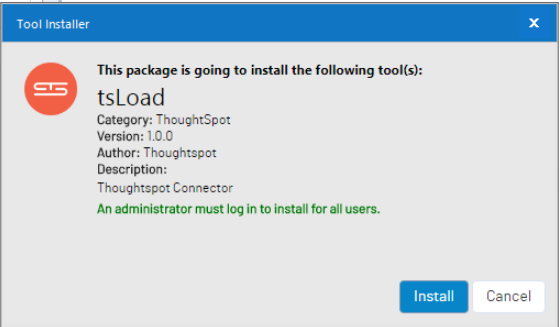
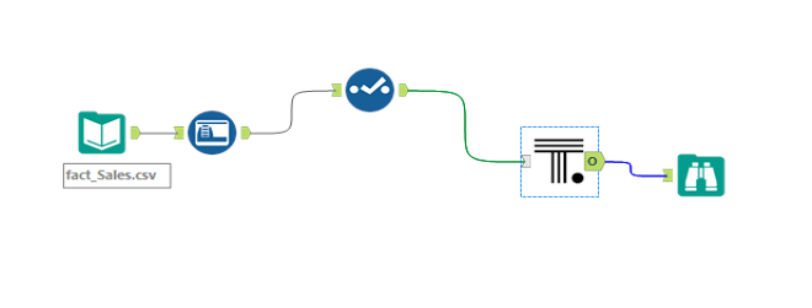

# ThoughtSpot Bulk Loader Alteryx Tool

The ThoughtSpot Bulk Loader Tool is a custom Alteryx tool that provides native [tsload](https://docs.thoughtspot.com/5.0/reference/data-importer-ref.html) capabilities in an Alteryx workflow.   The ThoughtSpot Bulk Loader tool supports both full and incremental data loads in a ThoughtSpot cluster through a data stream that does not copy data to the cluster.  The tool combines the ease of use of Alteryx and ThoughtSpot to quickly create, augment and move data to ThoughtSpot for Search and AI driven Analytics.

## Support

Please ask questions related to the Tool via the [ThoughtSpot Community](https://community.thoughtspot.com/) or Github community tools issues.

Copyright 2017 ThoughtSpot

Permission is hereby granted, free of charge, to any person obtaining a copy of this software and associated documentation files (the "Software"), to deal in the Software without restriction, including without limitation the rights to use, copy, modify, merge, publish, distribute, sublicense, and/or sell copies of the Software, and to permit persons to whom the Software is furnished to do so, subject to the following conditions:

The above copyright notice and this permission notice shall be included in all copies or substantial portions of the Software.

THE SOFTWARE IS PROVIDED "AS IS", WITHOUT WARRANTY OF ANY KIND, EXPRESS OR IMPLIED, INCLUDING BUT NOT LIMITED TO THE WARRANTIES OF MERCHANTABILITY, FITNESS FOR A PARTICULAR PURPOSE AND NONINFRINGEMENT. IN NO EVENT SHALL THE AUTHORS OR COPYRIGHT HOLDERS BE LIABLE FOR ANY CLAIM, DAMAGES OR OTHER LIABILITY, WHETHER IN AN ACTION OF CONTRACT, TORT OR OTHERWISE, ARISING FROM, OUT OF OR IN CONNECTION WITH THE SOFTWARE OR THE USE OR OTHER DEALINGS IN THE SOFTWARE.

## Getting Started

These intstruction will get you the ThoughtSpot Buld Loader tool installed within an Alteryx Designer or Alteryx Server environment

## Prerequisites

1. Alteryx Designer/Server version 2018.2 or later installed, licensed and operational. 

2. SSH access from the computer where Alteryx Designer/Server is installed to the ThoughtSpot cluster.

## Installing

To use the ThoughtSpot Bulk Loader tool within Alteryx, download the self install tool from [here.](Install/tsLoad.yxi)

Once downloaded, double click on the file (tsLoad.yxi) and the tool will self install.  It is possible for the install to seeen slow and take a few minutes to install.  It may appear like nothing is happening at first.  The install process will start Alteryx if not already running.  At some piont during the installation, you will see the following dialog box appear:

Click the **Install button** to complete the installation process.

Once done, you will find the ThoughtSpot Bulk Loader tool in the ThoughtSpot tab within Alteryx.   

## An Example

This is an example of taking a pipe-delimeted csv file and creating both a database and table within ThoughtSpot and loading the data in one workflow.  The workflow consists of an Input Data tool, an Auto Field tool, a Select Tool, a ThoughtSpot Bulk Loader tool and then a browser tool.  The data for this example can be found [here](ExampleData/fact_Sales.csv).

The parameters for the ThoughtSpot bulk loader include the following:

| ThoughtSpot Parameters | Description                                                                                                                                                                                                                                                                                                                                                                                                                                                                            |
| ---------------------- | -------------------------------------------------------------------------------------------------------------------------------------------------------------------------------------------------------------------------------------------------------------------------------------------------------------------------------------------------------------------------------------------------------------------------------------------------------------------------------------- |
| ThoughtSpot Instance   | IP address or FQDN of the primary node or cluster.                                                                                                                                                                                                                                                                                                                                                                                                                                     |
| Create Database        | (Optional)  Set this flag to create a database within the ThoughtSpot Cluster.  If a Database is already present, the workflow will continue but you will see an error in the log that is returned.                                                                                                                                                                                                                                                                                    |
| ThoughtSpot Database   | The ThoughtSpot database to create or use in the workflow.                                                                                                                                                                                                                                                                                                                                                                                                                             |
| ThoughtSpot Schema     | The schema to be used to load data into the ThoughtSpot cluster.  Default value: falcon_default_schema                                                                                                                                                                                                                                                                                                                                                                                 |
| User ID                | The User ID that is used to access the command line via **SSH** to the ThoughtSpot cluster.                                                                                                                                                                                                                                                                                                                                                                                            |
| Password               | The password for the User ID to access the command line via **SSH** to the ThoughtSpot cluster.                                                                                                                                                                                                                                                                                                                                                                                        |
| Table Name             | The table name that will be created (See Create Table parameter below) or used and loaded with data.                                                                                                                                                                                                                                                                                                                                                                                   |
| Boolean Representation | If a column of type of Boolean is in the table, describe the format.  Default value: T_F (Note:  if multiple boolean columns exist in a table, they must all use the same Boolean Representation.)                                                                                                                                                                                                                                                                                     |
| Maximum Ignored Rows   | Maximum number of rows to be ingored if load errors occur.                                                                                                                                                                                                                                                                                                                                                                                                                             |
| Truncate Data          | (Optional)  If selected, the data load will perform a full data refresh.                                                                                                                                                                                                                                                                                                                                                                                                               |
| Create Table           | (Optional)  If selected, the tool will try to drop the table in the Table Name parameter if it exists and (re)create the table based upon the supplied metadata in the workflow.  If the system cannot drop the table or if there is no table present, the workflow will not throw an error.  You may see an error if the column types from the workflow do not match the metadata that describes the table in ThoughtSpot.  All TQL statements are logged in the Browser Tool output. |
| Optional Primary Key   | (Optional) If the Create Table flag is selected and a Primary Key is selected from the drop down list, the table generated will add a primary key to the ddl.  If not selected, there will be no primary key added to the table.  Compound Keys are not supported.                                                                                                                                                                                                                     |

An example of ThoughtSpot Bulk Loader parameters that creates a database using the default schema in a ThoughtSpot cluster, creates a table with a primary key and then loads the data.

When creating a table, ThoughtSpot will convert the Alteryx data types using the following logic:

| __Alteryx__   | __ThoughtSpot__ |
|:------------- |:--------------- |
| Bool          | BOOL            |
| Byte          | INT             |
| Int16         | INT             |
| Int32         | INT             |
| int32:Forced  | INT             |
| Int64         | BIGINT          |
| FixedDecimal  | Double          |
| Float         | Double          |
| Double        | Double          |
| String        | VARCHAR(0)      |
| WString       | VARCHAR(0)      |
| V_WString     | VARCHAR(0)      |
| Date          | DATE            |
| TIME          | TIME            |
| DateTime      | DATETIME        |
| Anything Else | VARCHAR(0)      |

# Built With

- [Alteryx SDK](https://help.alteryx.com/developer/11.5/index.htm#Home.htm%3FTocPath%3D_____1)

- [Python 3.7](https://www.python.org/downloads/release/python-370)

# Contributing

Please read [Contributing.md](Contributing.md) for details on our code of conduct, and the process for submitting pull requests to us.

# Versioning

We use [SemVer](http://semver.org/) for versioning. For the versions available, see the [tags on this repository](https://github.com/thoughtspot/community-tools/tsLoad/tags).

# Future Versions

- Error Handling

# Authors

- Kendrick Heath - Initial Work - ThoughtSpot

See also the list of [Contributors](https://github.com/thoughtspot/community-tools/tsLoad/contributors) who participated in this project.

# Aknowledgements

Thank you to [Joe's Blog ](https://joelinoff.com/blog/?p=905)and many others through [stackoverflow](https://stackoverflow.com/) for sharing code examples using Paramiko.  

For a great reference on developing Alteryx Python tools using the SDK, please see [NikJ's A Beginner's Guide to the Python SDK in Alteryx]( https://community.alteryx.com/t5/Data-Science-Blog/Levelling-Up-A-Beginner-s-Guide-to-the-Python-SDK-in-Alteryx/ba-p/159440)
