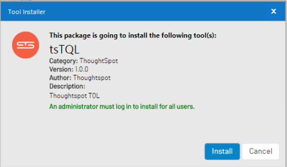
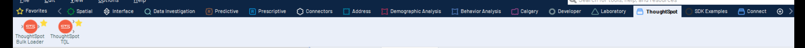
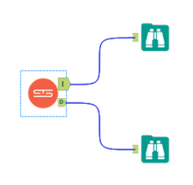

# ThoughtSpot TQL Alteryx Tool

The ThoughtSpot TQL Tool is a custom Alteryx tool that provides [tql](https://docs.thoughtspot.com/5.0/reference/sql-cli-commands.html) capabilities in an Alteryx workflow.   The ThoughtSpot TQL tool supports all TQL statements that can be run from the command line.  The tool combines the ease of use of Alteryx and ThoughtSpot to quickly execute TQL to help enable ThoughtSpot for Search and AI driven Analytics.

## Getting Started

These intstruction will get you the ThoughtSpot TQL tool installed within an Alteryx Designer or Alteryx Server environment

## Prerequisites

1. Alteryx Designer/Server version 2018.2 or later installed, licensed and operational. 

2. SSH access from the computer where Alteryx Designer/Server is installed to the ThoughtSpot cluster.

## Installing

To use the ThoughtSpot TQL tool within Alteryx, download the self install tool from [here.](Install/tsTQL.yxi)

Once downloaded, double click on the file (tsTQL.yxi) and the tool will self install.  It is possible for the install to seeen slow and take a few minutes to install.  It may appear like nothing is happening at first.  The install process will start Alteryx if not already running.  At some piont during the installation, you will see the following dialog box appear:

Click the **Install button** to complete the installation process.

Once done, you will find the ThoughtSpot TQL tool in the ThoughtSpot tab within Alteryx.   

## An Example

This is an example of selecting all rows from a fact table (fact_Sales.)  The workflow consists of the ThoughtSpot TQL tool and 2 Broswer tools.  The Broswer tool recieving data from the "I" connection returns log data related to the executed SQL statement.  The Browser tool recieving data from the "O" connection returns the actual data (if any) from the SQL statement.  In this case, the Browser tool would show pipe-delimeted output.  The statements could have also been read from a .tql file stored on the local operating system.  

The parameters for the ThoughtSpot bulk loader include the following:

| ThoughtSpot Parameters | Description                                                                                                                                                                  |
| ---------------------- | ---------------------------------------------------------------------------------------------------------------------------------------------------------------------------- |
| ThoughtSpot Instance   | IP address or FQDN of the primary node or cluster.                                                                                                                           |
| User ID                | The User ID that is used to access the command line via **SSH** to the ThoughtSpot cluster.                                                                                  |
| Password               | The password for the User ID to access the command line via **SSH** to the ThoughtSpot cluster.                                                                              |
| TQL File               | (Optional)  A file that is composed of valid TQL statements.                                                                                                                 |
| TQL Input              | (Optional)  Multi-Line input field for valid TQL statements.  Note:  The order of priority is TQL file and then TQL input.  TQL Input will not execute if a file is present. |

An example of ThoughtSpot TQL parameters that selects all records from a table.

# Built With

- [Alteryx SDK](https://help.alteryx.com/developer/11.5/index.htm#Home.htm%3FTocPath%3D_____1)

- [Python 3.7](https://www.python.org/downloads/release/python-370)

# Contributing

Please read [Contributing.md](Contributing.md) for details on our code of conduct, and the process for submitting pull requests to us.

# Versioning

We use [SemVer](http://semver.org/) for versioning. For the versions available, see the [tags on this repository](https://github.com/thoughtspot/community-tools/tsLoad/tags).

# Authors

- Kendrick Heath - Initial Work - ThoughtSpot

See also the list of [Contributors](https://github.com/thoughtspot/community-tools/tsLoad/contributors) who participated in this project.

# Aknowledgements

Thank you to [Joe's Blog ](https://joelinoff.com/blog/?p=905)and many others through [stackoverflow](https://stackoverflow.com/) for sharing code examples using Paramiko.  
